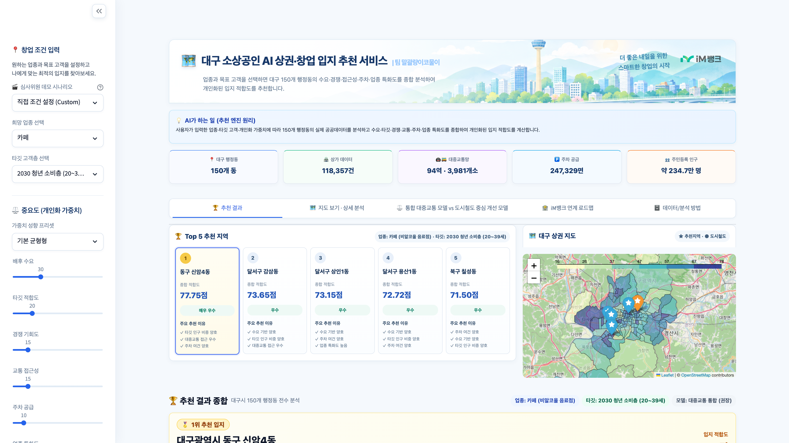

# 대구 소상공인 AI 상권·창업 입지 추천 서비스

[](LICENSE)
[](requirements.txt)
[](app/app.py)
[-brightgreen)](docs/TEST_REPORT.md)

- **Team**: 말괄량이코물이
- **Competition**: 2026 AI Blockchain Challenge in Daegu
- **Topic**: ❸ 소상공인·골목상권 디지털 금융
- **Default Model**: 통합 대중교통 모델 (Candidate B: 도시철도 70% + 시내버스 30%)
- **Test Status**: 132/132 PASS (12개 스위트 전수 통과, 100%)

> **Note**: 본 저장소는 [2026 AI Blockchain Challenge in Daegu] 출품작의 완전하고 자립적인(Self-contained) 소스 코드, 정제 데이터셋, 132대 전수 회귀 테스트 검증 패키지를 제공합니다.

---

## 1. 프로젝트 개요

본 프로젝트는 대구광역시 150개 행정동 및 11.8만 개 소상공인 상가 데이터를 기반으로, 예비 창업자가 선택한 **업종**과 **주 타깃 고객층**에 최적화된 상권 입지를 과학적으로 도출하는 **공공데이터 기반 다기준 의사결정형(MCDM) AI 입지 추천 서비스**입니다.

기존 역세권 중심 평가의 한계를 보완하기 위해 대구 3,981개 시내버스 정류소 및 월별 승하차 데이터를 결합한 **통합 대중교통 모델(도시철도 70% + 시내버스 30%)**을 사용합니다. 추천 설명은 실제 관측·집계 지표에 기반하며, 인터랙티브 GIS 대시보드에서 결과를 즉시 확인할 수 있습니다.

이 저장소는 **2026 AI Blockchain Challenge in Daegu** 소상공인·골목상권 디지털 금융 분야 출품을 위해 제작했습니다. 흩어진 공공 상권·교통·인구·주차 데이터를 하나의 재현 가능한 의사결정 흐름으로 통합해, 예비 창업자가 후보 지역을 비교하고 추천 근거까지 확인할 수 있도록 하는 것이 목표입니다.



---

## 2. 사용 기술 스택 (Tech Stack)

| 영역 | 기술 / 라이브러리 | 적용 목적 및 주요 역할 |
|---|---|---|
| **Language** | Python 3.10+ | 데이터 전처리 파이프라인, 추천 알고리즘 코어, 웹 대시보드 |
| **Data Processing** | Pandas, NumPy, PyArrow | 11.8만 점포 정제, 150개 행정동 공간 통계 집계, 고속 Parquet 입출력 |
| **Geospatial Analytics** | GeoPandas, Shapely, PyProj | 150개 행정동 공간 결합(Spatial Join), 좌표계 변환(EPSG:5179 ↔ 4326), 300m 버스 정류소 군집화 |
| **AI & Recommendation** | SciPy, MCDM (다기준 의사결정) | 백분위 정규화(Percentile Ranking), 6대 가중합 스코어링, Spearman 순위 상관도 검증 |
| **Explainable AI (XAI)** | Custom XAI Generator | 100% 수치 관측치 기반 강점/유의사항 템플릿 문장 생성 (Hallucination 원천 차단) |
| **Interactive UI** | Streamlit, Streamlit Components | 맞춤형 가중치 슬라이더, 반응형 레이더 차트, 실시간 랭킹 비교표, UTF-8-SIG CSV 내보내기 |
| **Map Visualization** | Folium, OpenStreetMap | 150개 행정동 Choropleth 경계 시각화, Top 5 추천 마커 및 94개 도시철도역 공간 레이어 |
| **Testing & Quality** | Python Unittest, Playwright, compileall | 12개 스위트 132대 자동화 회귀 테스트 (100% PASS), 브라우저 E2E 검증, 클린룸 격리 감사 |

---

## 3. 핵심 기능

1. **맞춤형 개인화 추천 (Personalized Recommendation)**
   - 7개 대표 업종(카페, 한식, 미용실, 학원, 종합소매, 숙박, 예술·스포츠) + 직접 입력 및 5개 타깃 고객층 선택
   - 6대 창업 전략 가중치 프리셋(기본 균형형, 배후수요 집중형, 타깃고객 집중형, 교통우선형, 경쟁회피형, 주차중심형) 및 슬라이더 미세 조정 지원 (자동 100% 정규화)

2. **6대 다차원 컴포넌트 평가 (MCDM Architecture)**
   - 배후수요(30%), 타깃인구 적합도(20%), 경쟁강도(15%), 대중교통 접근성(15%), 주차공급 여건(10%), 업종밀집도(10%)
   - 업종별 점포 0개 행정동에 대한 신규 진입 리스크 감점 보정($\alpha = 0.50$) 적용

3. **통합 대중교통 접근성 엔진 (Integrated Transit Accessibility)**
   - 도시철도 94개 역 가중 역세권 점수(70%) + 시내버스 정류소 밀도·승하차량 점수(30%) 결합
   - 대구 150개 행정동 결측치 0, 비역세권 91개 행정동의 접근성 지표 평균 변화 $\Delta +3.81$점(도시철도 모델 대비)

4. **인터랙티브 GIS 공간 시각화 (Interactive Top 5 GIS)**
   - Folium 기반 대구시 전역 150개 행정동 폴리곤 경계 렌더링
   - Top 1~5 추천 입지 강조 핀 마커 및 94개 도시철도역 위치 레이어 제공

5. **Data-Grounded 추천 사유 설명 (Explainable AI)**
   - 템플릿 기반 실제 지표 수치 및 시내 백분위 순위만을 인용하여 환각(Hallucination) 원천 차단
   - 추천 1위 상세 카드, 2~5위 컴팩트 카드, 레이더 차트, 지표별 강점/유의사항 브리핑

6. **모델 간 정량 비교 및 순위 상관도 분석 (Model Benchmarking)**
   - 통합 대중교통 모델(권장) vs 도시철도 중심 개선 모델 비교 탭 제공
   - 대구 전역 150개 행정동 대상 Spearman Rank Correlation 실시간 산출 및 순위 변동 추적
   - 6개 공식 데모 시나리오 기준 순위 상관계수 $\rho = 0.9915 \sim 0.9969$ (안정적 순위 보존 확인)
   - 추천 필터와 별개로 150개 전체 행정동을 선택할 수 있는 상세 분석 제공

---

## 4. 실제 구현 범위 및 확장 로드맵

| 구분 | 현재 구현 완료 범위 (본 저장소) | 미래 사업 확장 로드맵 (향후 연계) |
| :--- | :--- | :--- |
| **데이터** | • 대구 공공데이터 7종 전수 정제 완료<br>• 150개 행정동 단위 Feature Mart 구축<br>• 11.8만 상가, 94개 철도역, 3,981개 버스정류소 | • iM뱅크 가맹점 실매출 데이터 연계<br>• 통신사 실시간 성별/시간대별 생활유동인구<br>• 공공/민간 임대료 및 공실률 시세 정보 |
| **알고리즘** | • 공공데이터 기반 MCDM 다기준 평가 엔진<br>• Candidate B 도시철도-버스 통합 접근성 엔진<br>• 점포 0개 리스크 완화 감점 보정 ($\alpha = 0.50$) | • 실거래 기반 매출 예측 머신러닝 모델<br>• 상권 생존율/폐업 위험도 예측 AI<br>• LLM 기반 상권 심층 컨설팅 에이전트 |
| **서비스** | • 인터랙티브 Streamlit 웹 애플리케이션<br>• Top 5 지도 시각화 및 행정동별 분석 리포트<br>• 150개 행정동 추천 결과 CSV 내보내기 (UTF-8-SIG) | • iM뱅크 비대면 소상공인 정책자금 보증 심사 연계<br>• 소상공인 맞춤형 맞춤 금리 우대 패키지 제안 |

---

## 5. Quick Start

### A. 시스템 요구사항
- **OS**: macOS, Linux, Windows (크로스 플랫폼 호환)
- **Python**: 3.10 이상 (Python 3.10.21, 3.11.15, 3.14.5 검증 완료)

### B. 실행 방법 (macOS / Linux)
```bash
# 1. 가상환경 생성 및 활성화
python3 -m venv .venv
source .venv/bin/activate

# 2. 의존성 패키지 설치
pip install --upgrade pip
pip install -r requirements.txt

# 3. Streamlit 앱 실행 (포트 8501)
streamlit run app/app.py

# 또는 원클릭 스크립트 실행
chmod +x scripts/run_app.sh
./scripts/run_app.sh
```

### C. 실행 방법 (Windows PowerShell)
```powershell
# 1. 가상환경 생성 및 활성화
py -m venv .venv
.\.venv\Scripts\Activate.ps1

# 2. 의존성 패키지 설치
python -m pip install --upgrade pip
python -m pip install -r requirements.txt

# 3. Streamlit 앱 실행
streamlit run app/app.py

# 또는 배치 파일 실행
.\scripts\run_app.bat
```

브라우저에서 `http://localhost:8501` 접속 시 즉시 서비스가 구동됩니다.

---

## 6. 데이터 안내

본 저장소에는 오프라인 환경에서도 즉시 구동 및 검증이 가능하도록 정제된 Feature Mart 및 지오메트리 데이터가 동봉되어 있습니다.

- `data/processed/feature_mart/`: 행정동별 종합 피처마트, 업종별 피처, 점포 공간통계 피처 (Parquet/CSV)
- `data/processed/geojson/`: 대구광역시 150개 행정동 법정 경계 GeoJSON
- `data/processed/transit/`: 도시철도 94개 역 좌표 CSV 및 시내버스 150개 동 피처 Parquet/CSV
- `data/raw/bus/`: Phase 8 자동화 검증에 필요한 버스 정류소 위치 및 2026 이용량 공공데이터

> 상세 데이터 출처, 라이선스, 가공 방식은 [docs/DATA_SOURCES.md](docs/DATA_SOURCES.md) 및 [data/README_DATA.md](data/README_DATA.md)를 참조하십시오.

---

## 7. 추천 모델 사양

- **모델 아키텍처**: MCDM (Multi-Criteria Decision Making) 기반 백분위 점수 선형 결합
- **접근성 수식**:
  $$\text{Accessibility} = 0.70 \times \text{Subway Accessibility} + 0.30 \times \text{Bus Accessibility}$$
- **점수 정규화**: 각 지표별 백분위 순위(Percentile Rank) 정규화 적용 ($[0.0, 100.0]$)
- 상세 모델 수식, 가중치 산정 근거, 하이퍼파라미터는 [docs/MODEL_CARD.md](docs/MODEL_CARD.md)를 참조하십시오.

---

## 8. 테스트 및 품질 검증

본 저장소는 12개 스위트 총 **132/132 PASS (100%)**의 자동화 회귀 테스트를 통과했습니다.

```bash
# 전체 12개 테스트 스위트 (총 132개) 실행
python scripts/run_phase6_tests.py                 # Phase 6: 기본 추천 엔진 및 민감도 (10/10 PASS)
python scripts/run_phase7_validation.py            # Phase 7: 도시철도 모델 및 데모 일치성 (12/12 PASS)
python scripts/run_phase8_tests.py                 # Phase 8: 버스 데이터 통합 및 커버리지 (10/10 PASS)
python scripts/run_phase9_tests.py                 # Phase 9: Candidate B 서비스 통합 검증 (10/10 PASS)
python scripts/run_phase10_tests.py                # Phase 10: UI Release Candidate QA (10/10 PASS)
python scripts/run_phase14c_tests.py               # Phase 14C: Baseline 미진입 필터 방어 (6/6 PASS)
python scripts/run_phase15_hardening_tests.py       # Phase 15: 최종 Runtime/Schema/Claim/UI (12/12 PASS)
python scripts/run_phase16_interactive_regression.py # Phase 16: 데모/위젯/설명 회귀 (12/12 PASS)
python scripts/run_phase17_python_compat_tests.py   # Phase 17: Python 호환성/재현성 (7/7 PASS)
python scripts/run_phase19_crosslayer_consistency.py # Phase 19: Cross-Layer 정합성 (14/14 PASS)
python scripts/run_phase20_data_ui_integrity.py     # Phase 20: 데이터·UI 정합성 (14/14 PASS)
python scripts/run_phase21_final_defect_closure.py  # Phase 21: 최종 결함 종결 및 클린룸 (15/15 PASS)
```

상세 검증 결과는 [docs/TEST_REPORT.md](docs/TEST_REPORT.md) 및 [docs/REPRODUCIBILITY.md](docs/REPRODUCIBILITY.md)를 참조하십시오.

---

## 9. 프로젝트 디렉터리 구조

```text
daegu-commercial-ai/
├── README.md                     # 프로젝트 종합 안내서 (본 파일)
├── README_JUDGE.md               # 심사위원 5분 초고속 검증 가이드
├── LICENSE                       # MIT License
├── LICENSES.md                   # 공공데이터 및 오픈소스 라이선스 상세 고지
├── requirements.txt              # 검증된 파이썬 의존성 목록
├── submission_manifest.json      # 공식 제출 메타데이터 명세서
├── CHECKSUMS.sha256              # 무결성 검증 SHA-256 해시 목록
├── .env.example                  # 환경변수 예시 파일 (비밀키 미포함)
│
├── app/                          # 웹 대시보드 애플리케이션
│   ├── app.py                    # Streamlit 메인 엔트리포인트
│   └── assets/                   # UI 로고 및 대시보드 그래픽 에셋
│
├── src/                          # 추천 알고리즘 및 피처 엔지니어링 모듈
│   ├── features/                 # 버스/도시철도 피처 엔지니어링 모듈
│   └── recommendation/           # MCDM 추천 엔진, 개인화, XAI 설명기
│
├── data/                         # 정제 데이터셋
│   ├── processed/                # 전처리 완료 Feature Mart & GeoJSON
│   ├── raw/bus/                  # 버스 자동화 검증용 공공 원천 데이터
│   └── README_DATA.md            # 데이터 상세 구조 설명서
│
├── scripts/                      # 실행 및 132개 테스트 자동화 도구
│   ├── run_app.sh                # macOS/Linux 원클릭 실행 스크립트
│   ├── run_app.bat               # Windows 원클릭 실행 배치 파일
│   └── run_phase*.py             # Phase 6~21 회귀 테스트 스크립트
│
├── docs/                         # 심사위원용 기술 문서 세트
│   ├── PROJECT_STRUCTURE.md      # 상세 모듈/파일 구조 설명
│   ├── DATA_SOURCES.md           # 공공데이터 출처 및 라이선스
│   ├── MODEL_CARD.md             # 추천 모델 카드 및 한계 명시
│   ├── REPRODUCIBILITY.md        # 재현성 보장 환경 및 가이드
│   └── TEST_REPORT.md            # Phase 6~21, 총 132개 테스트 보고서
│
├── screenshots/                  # 고해상도 서비스 실행 화면 캡처
│   ├── 01_main_recommendation.png
│   ├── 02_transit_map.png
│   ├── 03_explainable_analysis.png
│   ├── 04_model_comparison.png
│   └── 05_financial_roadmap.png
│
└── submission/                   # Phase 19~21 감사 보고서 및 제출 서류(PDF)
    ├── documents/                # 제안 요약서.pdf, 참가 신청서.pdf
    └── phase*_report.md          # 단계별 최종 결함 종결 및 정합성 보고서
```

---

## 10. 모델 한계 및 주의사항 (Limitations)

1. **상대적 입지 적합도 지수**: 본 서비스가 산출하는 종합 점수(0~100점)는 대구시 150개 행정동 간의 상대적 우수성을 나타내는 지표이며, 창업 후 실제 매출액, 순이익, 대출 승인 여부, 사업 성공 확률을 직접 예측하거나 보증하지 않습니다.
2. **행정동 단위 분석의 한계**: 거시적 상권 경향성을 파악하기 위한 행정동 단위 집계 특성상, 동일 행정동 내부의 세부 필지/골목 단위의 미세한 입지 차이는 반영되지 않습니다.
3. **주차 공급 Proxy**: 주차 지표는 대구광역시 부설주차장 대장 데이터를 가공한 공간적 공급 여건 Proxy 피처이며, 실제 주차장 실시간 점유율이나 회전율을 나타내지 않습니다.
4. **민간 비공개 데이터 미반영**: 본 공공데이터 기반 프로토타입에는 실제 카드사 결제액, 통신사 실시간 유동인구, 상가 실거래 임대료/권리금 정보가 포함되어 있지 않으며, 이는 향후 로드맵 과제로 정의되어 있습니다.

---

## 11. 라이선스 (License)

본 프로젝트의 소스코드는 [MIT License](LICENSE)에 따라 자유롭게 이용할 수 있습니다. 수집된 공공데이터의 제공 조건 및 오픈소스 서드파티 라이선스에 관한 상세 내용은 [LICENSES.md](LICENSES.md)를 참조하십시오.

---
**팀 말괄량이코물이 | 2026 AI Blockchain Challenge in Daegu**
