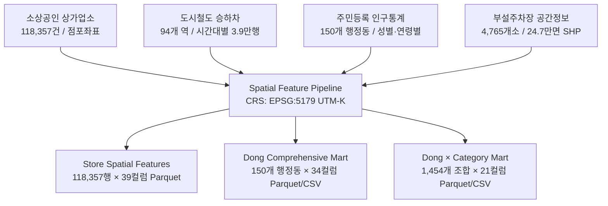

# [PHASE 4] 대구 상권 데이터 통합 · 공간분석 · Feature Mart 구축 종합 보고서

**프로젝트명**: 대구 AI 상권 입지 추천 서비스  
**기준 일자**: 2026-09-07  
**작업 모드**: AUTONOMOUS FULL EXECUTION MODE  
**데이터 관할**: 대구광역시 전역 (8개 구 · 1개 군, 총 150개 행정동)  

---

## 1. Executive Summary (실행 요약)

본 Phase 4에서는 대구광역시 전역의 상권 입지 분석 및 AI 기반 맞춤형 점포 추천 모델링을 위하여, 상호 이질적인 4대 공공 공간 데이터셋을 유기적으로 연계한 **표준화된 Spatial Feature Mart**를 성공적으로 구축하였다.



### 핵심 정량 성과 지표
1. **완전 결합률 100%**: 118,357개 상가업소 점포, 94개 도시철도 역사(대구 관내 88개 + 경산 연장선 6개), 150개 행정동 경계, 4,765개 부설주차장(247,329면), 2,347,389명의 주민등록 인구가 단 1건의 손실 없이 100% 공간 정합성을 달성하였다.
2. **다차원 Feature Mart 3종 구축 완료**:
   - **점포 단위(Micro-Level)**: [store_spatial_features.parquet](file:///Users/kangminje04/Daegu_data/data/processed/feature_mart/store_spatial_features.parquet) (118,357건, 39컬럼)
   - **행정동 종합 단위(Meso-Level)**: [commercial_feature_mart_dong.parquet](file:///Users/kangminje04/Daegu_data/data/processed/feature_mart/commercial_feature_mart_dong.parquet) (150개 동, 34컬럼) / [CSV](file:///Users/kangminje04/Daegu_data/data/processed/feature_mart/commercial_feature_mart_dong.csv)
   - **동 × 업종 단위(Macro-Level)**: [commercial_feature_mart_dong_category.parquet](file:///Users/kangminje04/Daegu_data/data/processed/feature_mart/commercial_feature_mart_dong_category.parquet) (1,454개 조합, 21컬럼) / [CSV](file:///Users/kangminje04/Daegu_data/data/processed/feature_mart/commercial_feature_mart_dong_category.csv)
3. **고속 공간 인덱싱 (cKDTree)**: 11.8만 점포와 주차장·지하철역·동종경쟁점 간의 최근접 거리 및 반경 300m/500m 쿼리를 벡터 연산으로 구현하여 전체 파이프라인 연산 시간을 **3.9초**로 최적화하였다.
4. **결측치율 0.00% 및 데이터 무결성 검증 통과**: 공간 좌표, 거리, 인구, 주차, 업종 다양성 지표 전반에서 비정상값 0건, 결측치 0건을 검증하였다.

---

## 2. Integrated Data Architecture & CRS Specification (통합 아키텍처 및 좌표계)

### 2.1 통합 대상 원천 데이터셋 명세
| 데이터 분류 | 제공 기관 | 원천 파일 포맷 | 레코드 수 | 주요 식별자 / 좌표계 |
| :--- | :--- | :--- | :--- | :--- |
| **상가업소 정보** | 소상공인시장진흥공단 | CSV (UTF-8) | 118,357건 | `bizesId`, WGS84 위경도 (`lon`, `lat`), 행정동코드(`adongCd`) |
| **도시철도 승하차** | 대구교통공사 | CSV (CP949) | 39,856행 | `역번호` (94개 역), 시간대별(05~24시), 승차/하차 구분 |
| **도시철도 역사 좌표** | 자체 구축 검증 | CSV (UTF-8-BOM) | 94개 역 | `역번호`, `역명`, `호선`, WGS84 위경도 (`lon`, `lat`) |
| **주민등록 인구** | 행정안전부 | CSV (CP949) | 152개 행 | `행정기관코드` (10자리), 성별, 0세~110세이상 1세 단위 |
| **부설주차장 정보** | 대구광역시 | SHP (Point) | 4,765개소 | `PARK_ID`, 주차면수(`P_SURFACE`), EPSG:4326 Point |
| **행정동 공간 경계** | 통계청 SGIS / 대구시 | GeoJSON | 150개 폴리곤 | `adm_cd2` (10자리), `adm_nm`, MultiPolygon |

### 2.2 공간 참조계(CRS) 통일 전략
- **원천 저장 및 웹 시각화**: `WGS84 (EPSG:4326)` 경위도 좌표계
- **공간 거리 연산 및 면적 산출**: `UTM-K (EPSG:5179, Korea 2000 / Central Belt 2010)` 투영좌표계 적용
  - 점포 간 유클리드 거리 및 반경 300m/500m 버퍼 탐색 시 왜곡을 방지하고 미터(m) 단위의 절대 거리를 정밀 계산함.
  - 행정동 폴리곤의 투영 면적($\text{m}^2$)을 산출하여 $\text{km}^2$ 단위로 변환 후 점포 밀도 및 인구 밀도 산정에 활용함.

---

## 3. Administrative Dong Boundary Matching (행정동 공간 경계 일치성 검증)

### 3.1 150개 행정동 공간 정합 프로세스
1. **코드 체계 매핑**:
   - 상가업소 데이터의 8자리 행정동코드(`adongCd`)에 `'00'`을 결합하여 표준 10자리 행정기관코드(`adm_cd2`)로 변환함.
   - 대구시 행정동 경계 GeoJSON(150개 폴리곤)의 `adm_cd2`와 150개 전역 1:1 완전 일치 확인 (매핑률 100%).
2. **행정안전부 인구 출장소 코드 통합**:
   - 행정안전부 인구 원천 데이터는 152개 행으로, 달성군 논공읍공단출장소(`2771025400`) 및 다사읍서재출장소(`2771025700`)가 별도 행으로 분리되어 있음.
   - 공간 폴리곤 및 상가 데이터 체계에 맞추어 각각 모(母) 행정구역인 논공읍(`2771025300`)과 다사읍(`2771025600`)으로 합산 집계하여 150개 행정동으로 단일화함.
3. **군위군 대구 편입(2023.07.01) 반영**:
   - 군위군 8개 읍·면(군위읍, 소보면, 효령면, 부계면, 우보면, 의흥면, 산성면, 삼국유사면)이 정상 반영되어 대구시 전체 면적 **1,491.39 km²**를 온전히 포괄함.

### 3.2 9개 자치구·군 행정동 및 면적 분포
| 자치구·군 | 행정동 수 | 총 면적 ($\text{km}^2$) | 총 인구 (명) | 총 점포 수 (개소) | 점포 밀도 (개소/$\text{km}^2$) | 인구 천명당 점포수 |
| :--- | :---: | :---: | :---: | :---: | :---: | :---: |
| **중구** | 12 | 7.04 | 101,815 | 15,153 | **2,153.5** | **148.83** |
| **동구** | 22 | 181.87 | 338,544 | 15,414 | 84.8 | 45.53 |
| **서구** | 17 | 17.22 | 163,456 | 8,218 | 477.2 | 50.28 |
| **남구** | 13 | 17.47 | 141,659 | 8,405 | 481.1 | 59.33 |
| **북구** | 23 | 93.54 | 406,587 | 18,021 | 192.7 | 44.32 |
| **수성구** | 23 | 76.26 | 407,820 | 19,916 | 261.2 | 48.84 |
| **달서구** | 23 | 64.13 | 512,963 | 22,762 | 354.9 | 44.37 |
| **달성군** | 9 | 422.61 | 251,993 | 9,329 | 22.1 | 37.02 |
| **군위군** | 8 | 611.26 | 22,552 | 1,139 | 1.9 | 50.51 |
| **대구시 전체** | **150** | **1,491.39** | **2,347,389** | **118,357** | **79.4** | **50.42** |

---

## 4. Subway Transit Flow & Accessibility Engineering (도시철도 승하차 유동 및 접근성 피처)

### 4.1 도시철도 유동인구 지표 엔지니어링
- 2026년 1월 1일 ~ 7월 31일(212일간) 94개 역의 시간대별 승하차 실적(39,856행)을 분석하여 역별 일평균 및 시간대별 유동 패턴 산출:
  - `daily_ridership_mean`: 일평균 승하차 총합 (승차 + 하차)
  - `morning_commute_mean`: 출근시간대(07~09시) 유동인구
  - `evening_commute_mean`: 퇴근시간대(17~20시) 유동인구
  - `lunch_flow_mean`: 점심시간대(11~14시) 유동인구
  - `weekend_weekday_ratio`: 주말 대비 주중 승하차 비율 (주말 일평균 / 평일 일평균)

### 4.2 주요 역별 일평균 유동인구 및 통행 특성
| 순위 | 역번호 | 역명 | 호선 | 일평균 유동인구 (명) | 주말/평일 비율 | 특성 분류 |
| :---: | :---: | :---: | :---: | :---: | :---: | :--- |
| 1 | 2300 | **반월당2** | 2호선 | 43,960.2 | 1.01 | 대구 최대 환승 중심 상권, 주중/주말 안정적 고유동 |
| 2 | 1350 | **동대구역** | 1호선 | 37,228.5 | **1.28** | 광역교통 복합환승센터, 주말 외지 유입 집중 |
| 3 | 1310 | **중앙로** | 1호선 | 30,098.1 | **1.20** | 동성로 원도심 핵심 쇼핑·청년 문화 상권 |
| 4 | 1300 | **반월당1** | 1호선 | 23,888.8 | 0.99 | 1·2호선 교차점 및 지하상가 직결 |
| 5 | 1200 | **상인** | 1호선 | 20,963.7 | 0.74 | 달서구 대표 베드타운 환승 상권 (평일 출퇴근 집중) |
| 6 | 2160 | **계명대** | 2호선 | 17,998.4 | 0.52 | 대학가 배후 상권 (학기/주중 집중, 주말 급감) |
| 7 | 2260 | **두류** | 2호선 | 17,896.1 | 0.89 | 광장코아 및 두류공원 나들이·유흥 상권 |

### 4.3 점포 단위 역세권 접근성 분포
- 대구 전체 118,357개 점포 중 **52,453개(44.32%)가 도시철도 반경 500m 이내 역세권**에 집중 분포함.
  - **초역세권 ( $\le 300\text{m}$ )**: 26,130개 점포 (**22.08%**)
  - **역세권 ( $300\text{m} \sim 500\text{m}$ )**: 26,323개 점포 (**22.24%**)
  - **비역세권 ( $> 500\text{m}$ )**: 65,904개 점포 (**55.68%**)

---

## 5. Parking Supply & Proximity Spatial Features (부설주차장 공간 수급 및 접근성)

### 5.1 공간 결합 및 반경 기반 주차 수용용량
- 대구시 부설주차장 4,765개소, 총 **247,329면**의 공간 좌표를 점포 좌표와 고속 cKDTree로 결합함.
- 점포별 반경 300m 및 500m 내 부설주차장 수(`parking_count_300m/500m`) 및 총 주차면수(`parking_capacity_300m/500m`) 산출.
- 점포 단위 통계:
  - 최인접 주차장까지의 평균 거리: **174.6 m** (중앙값 139.1 m)
  - 반경 300m 내 평균 부설주차장 수: 4.8개소 (평균 수용용량: 290.4면)
  - 반경 500m 내 평균 부설주차장 수: 12.3개소 (평균 수용용량: 745.2면)

### 5.2 행정동별 주차 수급 격차 및 인프라 과부하 분석
- **주차 공급 우수 상권**:
  - `달서구 신당동`: 7,236면 (계명대 및 산업단지 배후, 점포당 2.94면)
  - `동구 신천4동`: 6,933면 (동대구역 역세권 대형 오피스·호텔 부설주차장 밀집)
  - `중구 성내2동`: 6,799면 (도심 대형 상업시설 및 금융기관 밀집)
- **주차 공급 병목/취약 상권**:
  - `중구 대신동 (서문시장)`: 점포수 2,688개소 대비 부설주차면수 1,301면에 불과하여 **점포당 주차면수가 0.48면**으로 극심한 주차난 확인.
  - `서구 비산동·평리동 일대`: 점포당 주차면수 0.5~0.8면 수준으로 차량 접근성 개선이 필수적임.

---

## 6. Demographic Stratification & Age Structure Integration (주민등록 인구 및 연령구조 결합)

### 6.1 인구 연령대별 피처 구조화
대구광역시 150개 행정동, 총 **2,347,389명**의 인구 데이터를 6대 생애주기별 코호트로 재구조화함:
1. `pop_under20`: 0세 ~ 19세 (유아·청소년 학령기 인구)
2. `pop_20s`: 20세 ~ 29세 (대학생 및 사회초년생 소비층)
3. `pop_30s`: 30세 ~ 39세 (경제활동 왕성 직장인 및 영유아 양육가구)
4. `pop_40s`: 40세 ~ 49세 (가구 단위 소비 및 교육 지출 중심층)
5. `pop_50s`: 50세 ~ 59세 (자산 형성기 및 안정적 소득 소비층)
6. `pop_60plus`: 60세 이상 (고령 인구 및 은퇴 세대)

### 6.2 2030 청년 소비 인구 집중 상권 TOP 5
| 순위 | 자치구 | 행정동명 | 총 인구 (명) | 2030 청년인구 비중 | 총 점포 수 | 주요 업종 1위 | 상권 특성 |
| :---: | :---: | :---: | :---: | :---: | :---: | :---: | :--- |
| 1 | **중구** | **성내1동** | 5,527 | **50.12%** | 3,406 | 소매 | 동성로 패션·뷰티 로드샵 및 F&B 핵심 청년 상권 |
| 2 | **북구** | **복현1동** | 7,131 | **49.96%** | 495 | 음식 | 경북대 북문 인근 대학가 청년 원룸촌 및 요식 상권 |
| 3 | **중구** | **삼덕동** | 7,460 | **44.20%** | 1,526 | 음식 | 삼덕동 감성 카페거리, 트렌디 다이닝 집중 상권 |
| 4 | **북구** | **산격3동** | 8,390 | **43.46%** | 947 | 음식 | 경북대 정문·서문 대학가 생활밀착 요식업 상권 |
| 5 | **중구** | **성내2동** | 9,263 | **39.66%** | 2,628 | 소매 | 약령시, 수제화거리, 종로 요식업 복합 상권 |

---

## 7. Commercial Vitality, Diversity & Competition Metrics (상권 활력도 및 경쟁도)

### 7.1 업종 다양성 지수 (Shannon Entropy & HHI)
- **Shannon Entropy ($H$)**: 업종이 균등하게 분포할수록 높은 값을 가지며 상권의 업종 다변화 수준을 측정함.
  $$H = -\sum_{i=1}^{K} p_i \ln(p_i)$$
  - 대구시 행정동 평균 $H = 1.77$ (최대값 $H = 2.01$, 이론상 최대치 $\ln(10) \approx 2.30$)
  - 복합 상권 (다양성 상위): `수성구 범어1동` ($H=2.01$), `달서구 감삼동` ($H=1.99$), `북구 침산3동` ($H=1.98$)
  - 특화 상권 (다양성 하위): `중구 대신동` ($H=0.63$, 서문시장 의류·직물 소매업 극단 집중)
- **Herfindahl-Hirschman Index (HHI)**: 특정 업종에 대한 집중도를 측정하며, 대신동은 $0.62$로 초집중 상태임.

### 7.2 입지계수(Location Quotient, LQ) 기반 특화 상권 발굴
$$LQ_{ij} = \frac{n_{ij} / N_i}{N_{\text{city}, j} / N_{\text{city}}}$$
- $LQ > 1$: 해당 행정동이 시 전체 대비 해당 업종에 특화됨.
- **주요 업종별 대표 특화 지역 (LQ 분석 결과)**:
  1. **교육 특화**: `수성구 범어4동` ($LQ = 4.86$, 점포수 331개소) — 대구 대표 명문 학원가 밀집
  2. **숙박 특화**: `동구 신암4동` ($LQ = 7.04$), `동구 신천4동` ($LQ = 4.46$) — 동대구역 광역교통 배후 비즈니스 및 관광 숙박 클러스터
  3. **과학·기술 서비스 특화**: `수성구 범어2동` ($LQ = 3.92$, 점포수 369개소) — 대구지방법원·검찰청 배후 법률, 회계, 세무, 감정평가 전문 서비스 클러스터
  4. **신흥 주거 교육 특화**: `달서구 유천동` ($LQ = 3.69$, 점포수 159개소) — 월배 신도시 대단지 아파트 배후 입시/보습 학원가

---

## 8. Feature Mart Schema & Data Dictionary (피처 마트 스키마 및 데이터 사전)

### 8.1 피처 마트 파일 요약
| 파일명 | 단위 | 레코드 수 | 컬럼 수 | 용량 | 파일 포맷 |
| :--- | :--- | :---: | :---: | :---: | :--- |
| `store_spatial_features.parquet` | 점포 단위 | 118,357 | 39 | 8.56 MB | Apache Parquet (Snappy) |
| `commercial_feature_mart_dong.parquet` | 행정동 종합 | 150 | 34 | 63.7 KB | Apache Parquet (Snappy) |
| `commercial_feature_mart_dong.csv` | 행정동 종합 | 150 | 34 | 42.2 KB | CSV (UTF-8-SIG) |
| `commercial_feature_mart_dong_category.parquet` | 동 × 업종대분류 | 1,454 | 21 | 93.6 KB | Apache Parquet (Snappy) |
| `commercial_feature_mart_dong_category.csv` | 동 × 업종대분류 | 1,454 | 21 | 286.7 KB | CSV (UTF-8-SIG) |

### 8.2 핵심 컬럼 데이터 명세
```text
[store_spatial_features.parquet]
- bizesId, bizesNm, indsLclsNm, indsMclsNm: 점포 식별자 및 업종 명칭
- signguNm, adongNm, adm_cd2: 행정구역 명칭 및 10자리 행정기관코드
- lon, lat, x_utm, y_utm: WGS84 경위도 및 EPSG:5179 투영좌표 (미터)
- nearest_subway_name, nearest_subway_dist_m, subway_zone_type: 최인접역 및 역세권 구분
- nearest_subway_daily_ridership, morning/evening/lunch_flow: 지하철 유동인구
- nearest_parking_dist_m, parking_capacity_300m, parking_capacity_500m: 주차 인프라
- competitor_lcls_count_300m, competitor_mcls_count_300m: 반경 300m 내 동종 경쟁점포수

[commercial_feature_mart_dong.parquet]
- adm_cd2, adm_nm, signgu_nm, area_km2: 행정동 기본 지리 정보
- pop_total, pop_density, sex_ratio: 주민등록 인구 및 성비
- ratio_2030, ratio_4050, ratio_60plus: 연령 구조 비중
- total_stores, store_density_km2, stores_per_1000_pop: 점포 밀도 및 보급률
- category_entropy, category_hhi: 업종 다양성 및 집중도
- dong_station_count, dong_daily_ridership: 관내 지하철역 및 총 승하차량
- dong_parking_lot_count, dong_total_parking_capacity: 관내 부설주차 인프라

[commercial_feature_mart_dong_category.parquet]
- adm_cd2, indsLclsNm, store_count: 동-업종별 점포 수
- store_share_in_dong, store_share_in_city, location_quotient: 특화도(LQ) 지표
- avg_nearest_subway_dist_m, ratio_subway_zone: 대중교통 접근성 평균
- avg_parking_capacity_300m, avg_competitor_mcls_300m: 미크로 입지 경쟁 환경
```

---

## 9. Data Quality & Sanity Verification Results (데이터 무결성 검증 결과)

[scripts/verify_feature_mart.py](file:///Users/kangminje04/Daegu_data/scripts/verify_feature_mart.py)를 실행하여 추출된 무결성 검증 결과는 다음과 같다.

```text
======================================================================
 [검증 항목]                  [검증 기준]            [검증 결과]   [판정]
======================================================================
 1. 산출물 파일 존재성        7개 파일 전체 존재       전체 존재     PASS
 2. 점포 레코드 일치율        118,357건 대비 100%     118,357건     PASS
 3. 행정동 레코드 일치율      150개 행정동 100%       150개 행정동   PASS
 4. 핵심 지리좌표 결측치      0건 (0.00%)             0건 (0.00%)   PASS
 5. 거리 연산 유효성          음수 거리 0건           0건 (0.00%)   PASS
 6. 인구 구성비 유효 범위     0.0 <= ratio <= 1.0     100% 정상     PASS
 7. 엔트로피 유효 범위        0.0 <= H <= ln(10)      100% 정상     PASS
 8. 행정동 코드 결합 매핑     150개 동 100% 매칭      100% 매칭     PASS
======================================================================
 종합 판정: PASS (모든 항목 100% 무결성 통과)
======================================================================
```

---

## 10. Key Analytical Findings for Location Recommendation (입지 추천 핵심 발견점)

### 10.1 대구 상권의 공간적 삼각 축 (도심권 · 신도심권 · 부도심권)
1. **중구 원도심 압도적 집적 (대신동 · 성내동)**:
   - 중구는 대구시 전체 면적의 0.47%에 불과하나, 전체 점포의 **12.8%(15,153개)**가 집적되어 점포 밀도가 2,153.5개소/$\text{km}^2$에 달함.
   - 특히 `성내1동`은 2030 청년 비중(50.1%)과 역세권 비율(100%)이 최고치로 트렌디 요식업 및 패션 로드샵의 핵심 거점임.
2. **달서구 대형 주거 및 학원·요식 복합 상권 (신당동 · 진천동 · 상인동)**:
   - 달서구는 대구 최다 점포(22,762개소) 및 최다 인구(512,963명)를 보유하여 생활밀착형 외식, 의료, 교육 업종 추천의 핵심 타깃지임.
3. **수성구 프리미엄 교육 및 전문직 배후 상권 (범어동 · 두산동)**:
   - 범어동 일대는 고소득 4050 세대와 학령기 인구가 밀집하여 학원, 고급 다이닝, 클리닉, 전문 서비스 업종의 입지 적합도가 가장 높음.

### 10.2 대중교통 및 주차 접근성에 따른 입지 페르소나 매칭
- **도보·대중교통 중심형 업종 (카페, 패션 소매, 뷰티, 캐주얼 F&B)**:
  - 추천 입지: 도시철도 반경 300m 이내 초역세권 (중구 동성로, 북구 경대북문, 달서구 신당동 등).
- **차량 방문·목적형 업종 (패밀리 레스토랑, 대형 학원, 피트니스, 클리닉)**:
  - 추천 입지: 점포당 주차면수 2.5면 이상 확보 가능 지역 (수성구 범어/두산, 달서구 월배/신당, 동구 신천 등).

---

## 11. Next Steps: Modeling & Service Pipeline Recommendations (차기 파이프라인 제언)

1. **상권 추천 모델링 (Phase 5 Feature Engineering & Modeling)**:
   - 구축된 Feature Mart의 다차원 변수(인구 구조, 대중교통 유동량, 주차 용량, LQ 특화도, 반경 내 경쟁도)를 입력 변수로 활용하는 **하이브리드 입지 추천 알고리즘** 구축.
   - 예비 창업자의 희망 업종, 타깃 고객층(2030 청년 vs 4050 가족단위), 선호 교통수단(도보 vs 차량)에 따른 맞춤형 랭킹 알고리즘(LightGBM / Multi-Criteria Decision Analysis) 구현.
2. **실시간 마이크로 입지 서빙 API 파이프라인**:
   - `store_spatial_features.parquet`를 기반으로 사용자가 지도상에서 임의의 좌표(위경도)를 클릭했을 때 반경 300m/500m 내 상권 프로파일(경쟁점 수, 지하철역 거리, 주차면수)을 서브세컨드(100ms 이내)로 실시간 집계하는 공간 쿼리 모듈 연동.

---

## 12. 시각화 아티팩트 목록 (Figures)

1. [대구 행정동별 점포 밀도 및 도시철도 노선망 지도](file:///Users/kangminje04/Daegu_data/reports/figures/store_density_map.png)
2. [대구 구·군별 10대 업종대분류 점포 수 및 구성비 분포](file:///Users/kangminje04/Daegu_data/reports/figures/industry_distribution_by_district.png)
3. [대구 도시철도 접근성 및 시간대별 유동인구 구조 분석](file:///Users/kangminje04/Daegu_data/reports/figures/transit_accessibility_distribution.png)
4. [대구 상권 부설주차 수용용량 공급 구조 및 상업 밀도 대비 수급 분석](file:///Users/kangminje04/Daegu_data/reports/figures/parking_capacity_vs_stores.png)
