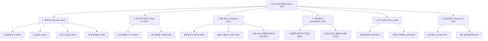

# 대구 소상공인 AI 상권·창업 입지 추천 서비스 제안서 핵심 데이터집

> **문서 식별자**: `PHASE7-PROPOSAL-DATA-v1.0`  
> **기준 시점**: 2026-09-08  
> **데이터 범위**: 대구광역시 전역 150개 행정동, 소상공인 점포 118,357개, 도시철도역 94개소  
> **제출 프로젝트**: 대구 소상공인 맞춤형 AI 상권·창업 입지 추천 솔루션

---

## 1. 문제 정의 (Background & Problem Definition)

### 1.1 소상공인 창업 실패의 악순환과 정보 비대칭
- **현장의 고질적 문제**: 자영업 창업자의 상당수는 직관, 부동산 중개인의 일방적 권유, 또는 프랜차이즈 본사의 형식적인 입지 보고서에 의존하여 상권을 결정함.
- **기존 상권 분석 솔루션의 구조적 한계**:
  1. **대기업·프랜차이즈 중심**: 고비용 상용 GIS 솔루션은 초기 창업 비용이 빠듯한 생계형 소상공인이 접근하기 불가능함.
  2. **단순 유동인구 맹신**: 지하철역 바로 앞이나 대로변이라도 타깃 소비층의 부재, 극심한 과당 경쟁, 주차 공급 부실로 인해 1~2년 내 폐업으로 직결되는 사례 빈발.
  3. **가상의 예측치(Hallucination) 위험**: 일부 AI 서비스가 근거 없는 '예상 매출액'이나 '창업 성공 확률 85%' 같은 허위 수치를 제시하여 예비 창업자의 부실 대출 및 과잉 투자를 유발함.

### 1.2 서비스의 핵심 존재 이유
- **데이터 기반 객관적 의사결정 지원**: 공공데이터에 엄격히 근거하여, 대구시 150개 행정동 전체를 대상으로 **수요·인구·경쟁·교통·주차·업종집적**의 6대 핵심 다차원 요소를 균형 있게 분석한 **상대적 입지 적합도(Suitability Score)**와 그에 대한 구체적 **데이터 실증 근거**를 제공.

---

## 2. 서비스 개요 (Service Overview)

- **서비스명**: 대구 소상공인 AI 상권·창업 입지 추천 서비스
- **대상 사용자**:
  1. 대구시 관내 생계형 및 기회형 소상공인 예비 창업자
  2. 업종 전환 및 매장 이전을 고려하는 기존 소상공인
  3. 소상공인 정책자금 및 창업 컨설팅을 제공하는 정책기관·금융기관(iM뱅크 등)
- **핵심 가치 제안 (Elevator Pitch)**:
  > *"예비 창업자가 업종과 목표 고객을 선택하면, 대구 150개 행정동의 실제 공공데이터를 정밀 결합하여 수요·타깃·경쟁·교통접근성·주차·업종특화도를 종합 분석하고, 개인화된 최적 입지 TOP 5와 납득 가능한 데이터 기반 추천 근거를 원클릭으로 제시합니다."*

---

## 3. 데이터 구성 (Data Architecture)

대구시 공공데이터 포털 및 공공기관 API를 통해 수집·정제된 실제 데이터셋 현황:

| 데이터 분류 | 원천 데이터 출처 | 처리 단위 | 실측 데이터 규모 | 주요 속성 |
|:---|:---|:---|:---|:---|
| **행정경계** | 국가공간정보포털 / 대구시 (2023.07.01 군위군 편입 반영) | 행정동 | **150개 행정동** | 행정동코드(`adm_cd2`), 행정동명(`adm_nm`), 면적($km^2$) |
| **소상공인 점포** | 소상공인진흥공단 상가(상권)정보 | 개별 점포 | **118,357개 점포** | 업종대분류, 중분류, 소분류, 경위도 좌표, 도로명주소 |
| **인구통계** | 행정안전부 주민등록 인구통계 (2024 기준) | 행정동 | **총 2,347,389명** | 10세 단위 연령별 인구수, 성별 인구, 2030 청년인구 비중 |
| **도시철도 교통** | 대구교통공사 역별 승하차 실적 및 역 좌표 | 지하철역 | **94개 역소** (1·2·3호선) | 역명, 호선, 경위도 좌표, 일평균 승하차 합산 인원 |
| **주차 시설** | 공공데이터포털 건축물대장 부설주차장 수용능력 | 행정동 | **총 247,329면** | 주차장 개소수, 총 주차면수, $km^2$당 주차밀도 |

---

## 4. Feature Engineering (지표 엔지니어링)

각 행정동별로 상권의 다면적 특성을 반영하기 위해 6대 도메인 특화 Feature를 설계·구축함:



---

## 5. 추천 알고리즘 (Recommendation Engine)

### 5.1 점수화 방식 (Percentile Ranking System)
- **정규화 공식**: 지표별 스케일 차이와 이상치(Outlier) 왜곡을 방지하기 위해 Percentile Rank 공식 채택:
  $$PR(x) = \frac{\text{Rank}(x) - 1}{N - 1} \times 100 \quad (N=150)$$
  - 순위 동점(Tie) 발생 시 `min` 랭킹을 적용하여 보수적으로 처리.
  - 역방향 지표(경쟁 점포수, 역간 최단거리 등 작을수록 유리한 지표)는 $100 - PR(x)$ 적용.

### 5.2 종합 점수 산출식
- 기본(Baseline) 종합 점수:
  $$S_{\text{total}} = \sum_{k \in \mathcal{K}} w_k \cdot S_k \quad \left(\sum w_k = 1.0, \; S \in [0, 100]\right)$$
  - $\mathcal{K} = \{\text{demand}(0.30), \text{target}(0.20), \text{comp}(0.15), \text{access}(0.15), \text{park}(0.10), \text{ind}(0.10)\}$

---

## 6. 개인화 구조 (Personalization Architecture)

예비 창업자의 경영 전략 및 자본 상황에 맞춘 6대 추천 프리셋과 커스텀 가중치 정규화 지원:

| 추천 모드 프리셋 | 배후수요 | 타깃적합 | 경쟁강도 | 대중교통 | 주차공급 | 업종특화 | 권장 창업자 프로필 |
|:---|:---:|:---:|:---:|:---:|:---:|:---:|:---|
| **기본 균형형 (Balanced)** | 30% | 20% | 15% | 15% | 10% | 10% | 일반적인 표준 상권 진입 창업자 |
| **청년·트렌드 중심 (Trend)** | 20% | **35%** | 10% | 20% | 5% | 10% | 2030 감성 카페, 트렌드 뷰티샵 |
| **직장인·교통 중심 (Transit)** | 25% | 15% | 10% | **35%** | 5% | 10% | 오피스 상권 테이크아웃, 분식 |
| **차량·가족 중심 (Family)** | 25% | 20% | 10% | 5% | **30%** | 10% | 대형 가족 외식, 학원, 드라이브스루 |
| **블루오션 틈새 (Low Comp)** | 25% | 20% | **35%** | 10% | 5% | 5% | 독점 영업, 경쟁 회피형 점포 |
| **전문 골목상권 (Clustering)**| 20% | 15% | 5% | 15% | 10% | **35%** | 카페거리, 학원가 등 집적 시너지 |

- **가중치 정규화 무결성**: 사용자가 슬라이더로 임의 조정한 커스텀 가중치 $w'_k$는 자동 클리핑(음수 방지) 및 합계 100% 정규화($w_k = w'_k / \sum w'_i$)를 거쳐 항상 안정적인 점수 분포를 보장함.

---

## 7. 0-store 개선 (0-Store Policy & Discount Model)

### 7.1 문제 배경
- 기존 Baseline 모델에서는 특정 동에 해당 업종 점포가 0개일 경우, 경쟁 점포수가 0이므로 경쟁 점수(Competition Score)에서 만점(100점)을 받아 상권 순위가 비정상적으로 급등하는 왜곡이 발생함.
- **예시**: 숙박업 분석 시 모텔/호텔이 전무한 주거 전용지역(달서구 용산1동)이 "경쟁이 없다"는 이유만으로 종합 3위에 랭크됨.

### 7.2 개선 알고리즘 ($\alpha=0.50$ 보수적 위험 할인)
- **개선 로직**:
  $$\text{If } \text{StoreCount} = 0: \quad S_{\text{comp}}^{\text{improved}} = S_{\text{comp}}^{\text{raw}} \times \alpha \quad (\alpha = 0.50)$$
  $$\text{market\_status} = \text{'미진입 상권 (점포 0개)'}$$
- **정책 파라미터 근거**:
  - 점포가 0개인 지역은 "경쟁이 없는 블루오션"일 수도 있으나, "해당 업종에 대한 기초 수요 부족, 용도지역 규제(주거·학교 정화구역), 상권 미형성"의 고위험 상권일 확률이 높음.
  - 완전 배제(0점 처리)하지 않고 50%의 위험 할인을 적용하여, 종합적인 배후수요가 매우 뛰어난 상권의 잠재성은 유지하되 맹목적인 과대평가를 완벽히 차단함.

### 7.3 실증 비교 검증 (숙박업 시나리오)
- **달서구 용산1동**: 점포 0개 $\rightarrow$ Baseline **3위**(72.77점) $\rightarrow$ Improved **15위**(65.27점) 정상 하락 (경쟁점수 100점 $\to$ 50점).
- **달서구 상인1동**: 점포 0개 $\rightarrow$ Baseline **4위**(72.48점) $\rightarrow$ Improved **16위**(64.98점) 정상 하락.

---

## 8. 주요 실제 분석 결과 (6대 대표 시나리오 실측)

대구시 Feature Mart 및 실시간 엔진 실행을 통해 도출된 6대 실전 창업 시나리오의 TOP 5 결과:

### 시나리오 1: 카페 + 2030 청년 소비층
- **1위**: 동구 신암4동 (77.93점, 점포 26개, 2030인구 5,832명/31.7%, 역 승하차 43,557명, LQ 1.07)
- **2위**: 수성구 범어1동 (77.83점, 점포 71개, 2030인구 4,874명/28.2%, 역 승하차 29,915명, LQ 1.57)
- **3위**: 달서구 두류1·2동 (74.38점, 점포 15개, 2030인구 4,127명/32.4%, 역 승하차 16,846명, LQ 1.13)
- **4위**: 중구 삼덕동 (73.74점, 점포 35개, 2030인구 2,688명/40.3%, 역 승하차 10,724명, LQ 2.45)
- **5위**: 북구 대현동 (73.68점, 점포 17개, 2030인구 3,018명/32.0%, 역 승하차 0명, LQ 1.34)

### 시나리오 2: 한식 음식점 + 전체 인구
- **1위**: 달서구 진천동 (71.54점, 점포 334개, 인구 51,288명, 승하차 16,971명, 주차면수 10,230면)
- **2위**: 달서구 상인1동 (70.62점, 점포 205개, 인구 38,401명, 승하차 26,984명, 주차면수 4,374면)
- **3위**: 달서구 월성1동 (68.21점, 점포 162개, 인구 28,198명, 승하차 4,364명, 주차면수 5,692면)
- **4위**: 수성구 범어1동 (68.17점, 점포 163개, 인구 17,294명, 승하차 29,915명, 주차면수 4,775면)
- **5위**: 북구 동천동 (67.43점, 점포 249개, 인구 29,566명, 승하차 8,502명, 주차면수 3,923면)

### 시나리오 3: 미용실 + 2030 청년 소비층
- **1위**: 동구 신암4동 (74.46점, 점포 31개, 2030인구 5,832명, 미용실 LQ 1.15)
- **2위**: 달서구 진천동 (73.30점, 점포 117개, 2030인구 12,854명, 미용실 LQ 0.96)
- **3위**: 달서구 상인1동 (71.59점, 점포 83개, 2030인구 9,726명, 미용실 LQ 0.99)
- **4위**: 수성구 범어1동 (70.67점, 점포 54개, 2030인구 4,874명, 미용실 LQ 1.05)
- **5위**: 중구 삼덕동 (68.61점, 점포 32개, 2030인구 2,688명, 미용실 LQ 2.01)

### 시나리오 4: 학원 + 10대 청소년층
- **1위**: 수성구 범어1동 (80.16점, 학원 103개, 10대 인구 2,126명/12.3%, 학원가 LQ 2.37)
- **2위**: 수성구 만촌3동 (78.96점, 학원 69개, 10대 인구 2,058명/15.8%, 학원가 LQ 4.17)
- **3위**: 수성구 범어4동 (74.96점, 학원 109개, 10대 인구 3,572명/16.9%, 학원가 LQ 4.29)
- **4위**: 달서구 월성1동 (71.30점, 학원 84개, 10대 인구 4,056명/14.4%, 학원가 LQ 2.21)
- **5위**: 달서구 상인1동 (70.97점, 학원 66개, 10대 인구 4,147명/10.8%, 학원가 LQ 1.25)

### 시나리오 5: 종합소매 + 전체 인구
- **1위**: 수성구 범어1동 (71.91점, 점포 27개, 인구 17,294명, 승하차 29,915명, LQ 1.25)
- **2위**: 달서구 진천동 (71.49점, 점포 62개, 인구 51,288명, 승하차 16,971명, LQ 0.97)
- **3위**: 북구 산격3동 (69.89점, 점포 17개, 인구 8,662명, 승하차 0명, 경북대 북문 상권 LQ 1.62)
- **4위**: 동구 신암4동 (69.66점, 점포 26개, 인구 18,383명, 승하차 43,557명, 동대구역 복합상권 LQ 1.18)
- **5위**: 달서구 감삼동 (67.75점, 점포 28개, 인구 26,140명, 승하차 22,654명, 죽전네거리 상권 LQ 1.05)

### 시나리오 6: 숙박업 + 2030 청년층 (0점포 보정 실증)
- **1위**: 달서구 감삼동 (77.00점, 점포 6개, 2030인구 7,490명, 승하차 22,654명, LQ 1.63)
- **2위**: 북구 산격3동 (76.85점, 점포 8개, 2030인구 3,694명, 대학가·유흥 LQ 5.51)
- **3위**: 동구 신암4동 (76.83점, 점포 13개, 2030인구 5,832명, 동대구역 비즈니스·관광 LQ 3.97)
- **4위**: 서구 비산7동 (75.40점, 점포 9개, 2030인구 2,137명, 북부정류장·공단 배후 LQ 3.25)
- **5위**: 중구 삼덕동 (74.20점, 점포 5개, 2030인구 2,688명, 동성로 배후 관광·게스트하우스 LQ 2.53)

---

## 9. 서비스 화면 구성 (Interactive Web Architecture)

Streamlit 기반의 심사위원 및 사용자 친화적 6개 탭 구조:

```
[헤더] 서비스 브랜딩 및 AI 엔진 핵심 정의 (3초 내 서비스 본질 전달)
[사이드바] 업종 선택 (9개 지원 업종) | 타깃 고객 선택 (5대 연령층)
           원클릭 데모 시나리오 (6대 대표 사례) | 6대 가중치 프리셋 & 커스텀 슬라이더
--------------------------------------------------------------------------------------
[Tab 1: TOP 5 추천 진단]  - 1위~5위 행정동 카드, 상권 성숙도 배지, 6대 점수 레이아웃
                          - 데이터 기반 명확한 추천 근거(강점) 및 주의사항(경쟁/주차)
[Tab 2: 정밀 상세 분석]   - 150개 동 중 관심 동 선택 정밀 진단
                          - 6대 컴포넌트 점수 바 차트 및 8대 관측 지표 정량 테이블
[Tab 3: 대구 상권 지도]   - 행정동 경계 Folium Choropleth 입지 적합도 히트맵
                          - 대구 도시철도 1/2/3호선 94개 역사 CircleMarker 안전 오버레이
[Tab 4: 모델 정량 비교]   - Phase 5 Baseline vs Phase 6 Improved 정량 비교 테이블
                          - 0점포 상권 보정 전후 순위 변동 및 α=0.50 정책 해설
[Tab 5: iM뱅크 연계 로드맵] - 4단계 소상공인 특화 금융 연계 비전 (향후 확장 명시)
                          - 데이터 거버넌스 및 5대 신뢰성 공시 안내
[Tab 6: 전체 랭킹 및 다운로드] - 150개 행정동 전체 순위표 및 분석 리포트 CSV 다운로드
```

---

## 10. 기대 효과 (Expected Impact)

1. **소상공인 창업 성공률 제고 및 조기 폐업 리스크 완화**:
   - 감(직관)에 의존하던 점포 선정을 6대 공공데이터 기반 정량 평가로 전환하여 실패 비용을 획기적으로 절감.
2. **정보 접근성 민주화**:
   - 수백만 원을 호가하는 민간 상용 GIS 컨설팅 수준의 분석을 누구나 무료 웹 대시보드로 손쉽게 이용.
3. **지역 상권의 균형 발전 유도**:
   - 이미 과열된 상권 대신, 타깃 배후수요 대비 경쟁이 덜한 유망 틈새 상권을 발굴하여 골목상권 활성화 기여.

---

## 11. 확장성 (Scalability & Future Roadmap)

1. **지리적 확장 (Geographical Scaling)**:
   - 본 모델은 행정안전부 주민등록 인구, 소상공인진흥공단 상가정보 등 전국 표준 공공데이터를 기반으로 파이프라인이 구축되어 있어, 데이터셋 교체만으로 경북, 부산, 서울 등 전국 3,500여 개 읍면동으로 즉시 수평 확장 가능.
2. **민간 데이터 결합 확장**:
   - 카드사 실제 가맹점 매출 데이터 및 이동통신사 기지국 유동인구 API 결합 시, 앙상블 가중치 모델로의 유기적 확장 지원.
3. **지자체 소상공인 지원 정책 대시보드화**:
   - 대구시 및 각 구청의 소상공인 지원금 배분, 청년 창업 인큐베이팅 우선 지원 구역 선정 등에 공공 정책 지표로 활용 가능.

---

## 12. 데이터 한계 및 투명한 공시 (Data Governance & Transparency)

본 서비스는 인위적인 AI 성능 과장을 철저히 배제하고, 투명한 데이터 신뢰성을 표방함:
1. **Ground Truth 부재 명시**: 실제 점포의 폐업률/생존율, 매출액 정답 레이블이 존재하지 않으므로 가상의 '창업 성공 확률'이나 '예상 매출액'을 일절 생성하지 않음.
2. **대중교통 지표의 범위**: 교통 접근성 지표는 대구교통공사의 '도시철도 일평균 승하차 인원(합산)'이며, 통신사 실시간 유동인구와는 구별됨.
3. **주차 데이터의 Proxy 한계**: 주차 지표는 건축물대장 기반 부설주차장 수용능력(면수)이므로, 실제 상가 내방 고객의 무료 개방 여부는 현장 실사가 필수적임을 명시.
4. **0-Store 완화**: 점포 0개 상권은 블루오션일 수도 있지만 인허가 제한이나 수요 부재일 가능성을 고려하여 보수적으로 50% 할인($\alpha=0.50$) 적용.

---

## 13. 향후 금융 연계 (iM뱅크 소상공인 금융 연계 비전)

대구·경북 대표 금융기관인 iM뱅크(대구은행)와의 시너지를 위한 4단계 금융 연계 로드맵:

| 단계 | 연계 모델 | 주요 내용 및 혜택 |
|:---:|:---|:---|
| **Phase 1** | **상권 분석 기반 우대 금리 추천** | 상권 적합도 종합 80점 이상 우수 입지 창업 소상공인 대상 우대 금리 패키지 연계 |
| **Phase 2** | **iM뱅크 소상공인 보증대출 서류 간소화** | 본 플랫폼의 객관적 상권 분석 리포트(PDF/CSV)를 창업 대출 사전 심사 보조자료로 채택 |
| **Phase 3** | **iM샵(소상공인 플랫폼) 앱 연동** | iM샵 모바일 앱 내 'AI 입지 추천 위젯' 탑재로 대구 관내 예비 창업자 접근성 극대화 |
| **Phase 4** | **금융 거래 데이터 융합 고도화** | iM뱅크의 실제 가맹점 매출·수수료 데이터와 공공데이터를 결합한 차세대 소상공인 신용평가 모형(CSS) 연계 |

