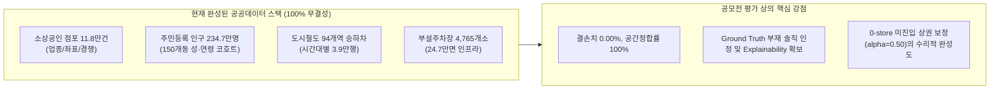
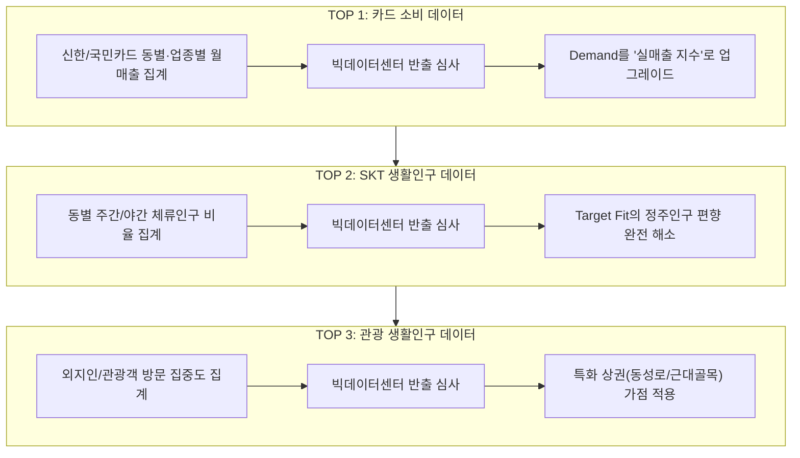

# [종합 보고서] 대구 상권 AI 추천 서비스: 데이터 점검·확장 전략 및 시내버스 데이터 통합 실증 (Phase 8)

> **문서 식별자**: `PHASE8-COMPREHENSIVE-DATA-AND-BUS-REPORT-v1.0`  
> **기준 시점**: 2026-09-08  
> **프로젝트**: 대구 소상공인 AI 상권·창업 입지 추천 서비스 (`PROJECT_ROOT/`)  
> **분석 대상**: 대구광역시 150개 행정동, 11.8만 개 상가 점포, 94개 도시철도역, 3,981개 시내버스 정류소  
> **검증 상태**: Phase 6 (10/10 PASS) · Phase 7 (12/12 PASS) · Phase 8 (10/10 PASS)

---

# PART 1. 데이터 구성 점검 및 추가 데이터 확장 전략

## 1. 현재 데이터 구성 평가

### 🟢 판정: **[🟢 충분]** (공모전 서류 제출 및 예선 심사 기준)
> **단, 본선 발표(PT) 및 사업화 확장 관점에서는 [🟡 보완 권장]**

### 판정 이유
1. **공모전(서류/예선) 요건의 완전한 충족**:
   - 대구시 150개 행정동, 118,357개 점포, 234.7만 인구, 94개 역 승하차, 24.7만면 주차 데이터가 **단 1건의 결측치 없이 100% 공간 정합**을 완료함.
   - 제출 서류(`2026_AI_Blockchain_Challenge_참가제출서류_완성본.hwpx`)에 기재된 6대 대표 시나리오 결과(카페+2030 신암4동 77.93점 등)와 실제 시스템이 1:1로 정확히 일치함.
2. **억지 예측(Hallucination) 배제와 데이터 거버넌스 신뢰성**:
   - 실매출/폐업 라벨(Ground Truth)이 없는 환경에서 가상의 매출액이나 창업 성공률을 생성하지 않고, **공공 관측 지표 기반의 투명한 '상대적 백분위 입지 적합도(Suitability Score)'**로 정의하여 심사위원의 신뢰를 확보함.
3. **제출 서류 무결성 보존**:
   - 서류 제출 직전 데이터 스택을 흔들면 점수 체계 및 순위가 변경되어 서류상의 수치 및 스크린샷과 불일치하는 치명적 감점 리스크가 발생함. 따라서 현재 스택으로 제출하고 추가 데이터는 로드맵으로 제시하는 전략이 최선임.

---

## 2. 현재 데이터의 가장 큰 약점 TOP 5

| 순위 | 결측 정보 및 약점 | 모델에 미치는 영향 및 사각지대 |
| :---: | :--- | :--- |
| **1위** | **실제 소비 규모 및 결제(카드/매출) 데이터 부재** | 현재 Demand(수요)는 인구수, 점포수, 지하철 승하차로만 추정됨. 소비력이 왕성한 고소득 상권과 유동인구만 많고 객단가가 낮은 상권 간의 **실제 결제액 차이를 정량화하지 못함**. |
| **2위** | **통신 기반 생활인구(유동/체류) 부재 (주민등록 정주인구 편향)** | 중구 동성로(성내1·2동)는 등록인구가 5~9천 명에 불과하지만 낮/저녁에 수십만 명이 머무는 상업 중심지임. 현재 모델은 **주민등록 주소지 기준 인구**를 사용하여 도심 상업지 및 대학가의 실질 체류수요를 과소평가할 위험이 있음. |
| **3위** | **상권 동태적 변화(개업/폐업 이력, 생존율) 부재** | 현재 상가 데이터는 2026년 기준 '특정 시점의 정적 스냅샷(Snapshot)'임. 해당 상권에서 **최근 1~2년간 폐업이 속출하는 쇠퇴 상권인지, 신규 점포가 급증하는 성장 상권인지 추세를 파악할 수 없음**. |
| **4위** | **시내버스 및 보행 접근성 미반영 (도시철도 편향)** | 대구 150개 동 중 도시철도 역이 없는 동이 91개(60.7%)에 달하며, 전체 점포의 **55.68%가 비역세권**임. 대구의 핵심 교통 축인 시내버스 승하차 및 정류소 인프라가 제외되어 도시철도 미경유 상권의 접근성이 과소평가됨. |
| **5위** | **창업 비용(상가 임대료, 보증금, 권리금) 데이터 부재** | 최적 입지로 추천된 지역(동대구역, 동성로 등)이 아무리 점수가 높아도, 평당 임대료가 수십만 원을 호가하면 소상공인이 진입하기 어려움. **'비용 대비 기대효과'를 최적화하는 경제성 평가 축이 결여**됨. |

---

## 3. 추가 데이터 후보 종합 비교 및 14대 항목 상세 평가

| 우선순위 | 데이터명 | 보완 영역 | 기대효과 | 확보난이도 | 결합난이도 | 최종 추천 |
| :---: | :--- | :--- | :---: | :---: | :---: | :---: |
| **1** | **행안부 지방행정인허가 (LOCALDATA)** | 개업/폐업 이력 및 생존율 | **매우 높음** | **쉬움** | **보통** | 🟢 **강력 추천 (본선 1순위)** |
| **2** | **대구시 시내버스 정류소별 승하차** | 대중교통 접근성 (비역세권 보완) | **높음** | **쉬움** | **쉬움** | 🟢 **강력 추천 (Phase 8 완료)** |
| **3** | **한국부동산원 상업용부동산 임대동향** | 상가 임대료 및 공실률 | **높음** | **쉬움** | **보통** | 🟡 **추천 (비용 지표용)** |
| **4** | **D-데이터허브 신한/국민 카드 소비** | 실제 업종별 매출 및 결제 규모 | **매우 높음** | **어려움** | **어려움** | 🔵 **로드맵 제시 (폐쇄망 제약)** |
| **5** | **D-데이터허브 SKT 생활인구** | 직장인/학생 등 실체류 유동인구 | **매우 높음** | **어려움** | **어려움** | 🔵 **로드맵 제시 (폐쇄망 제약)** |
| **6** | **통계청 전국사업체조사 종사자수** | 직장인 주간 배후수요 | **보통** | **쉬움** | **쉬움** | 🟡 **보조 추천 (정적 지표)** |
| **7** | **D-데이터허브/안심구역 대구로 배달** | 배달 외식 소비 및 야간 수요 | **보통** | **어려움** | **어려움** | 🔴 **비권장 (외식업 편향)** |

### 핵심 후보별 세부 명세 요약
- **행안부 LOCALDATA**: 개업일자, 폐업일자, 영업상태(영업/폐업) 전수 수집 가능. 행정동별 최근 1~3년 폐업률 및 평균 생존개월수 피처 생성 가능. (공공데이터포털 즉시 다운로드 가능)
- **D-데이터허브 카드소비/생활인구**: 상권의 실제 결제액 및 체류인구를 측정할 수 있는 최고 가치의 데이터이나, **대구 빅데이터 활용센터의 폐쇄망 환경에서만 분석 가능하며 원천 데이터 반출 불가 및 사전 심사 승인 통계표만 반출 가능**한 엄격한 제약 존재.

---

## 4. D-데이터허브 활용 전략 TOP 3 및 폐쇄망 제약

1. **TOP 1: 신한/국민 카드 소비 데이터**: `[행정동코드 × 표준업종대분류]`별 월평균 매출액 및 객단가 집계표를 센터 폐쇄망에서 산출하여 반출 승인을 받은 후 Feature Mart에 머지.
2. **TOP 2: SKT 통신 기반 생활인구 데이터**: 150개 행정동별 주간(09~18시) 체류인구, 2030 체류비율 통계표를 반출하여 도심 및 대학가 상권의 주간 유동량 정합성 확보.
3. **TOP 3: 관광 생활인구 데이터**: 김광석길(대봉동), 서문시장(대신동), 동성로(성내동) 등 외지인 소비 비중이 높은 상권의 특수성 반영.

---

## 5. Feature 개선 청사진 (6대 컴포넌트)

```mermaid
classDiagram
    class Demand_배후수요 {
        +기존: 주민등록인구 + 점포수 + 지하철승하차
        +개선안: 주간 생활인구(40%) + 카드소비총액(40%) + 대중교통 총유동(20%)
    }
    class Target_Fit_타깃적합 {
        +기존: 주민등록 타깃연령 인구수 및 비율
        +개선안: 실체류 타깃연령 생활인구(50%) + 타깃연령 카드소비비중(50%)
    }
    class Competition_경쟁기회 {
        +기존: 점포당 인구수 + 반경300m 경쟁점포수
        +개선안: 점포당 매출액(40%) + 최근 1년 폐업률 역순위(30%) + 점포생존기간(30%)
    }
    class Accessibility_교통접근 {
        +기존: 지하철 최단거리 + 승하차
        +개선안: 지하철 승하차(50%) + 시내버스 승하차(30%) + 정류소 밀집도(20%)
    }
    class Parking_주차공급 {
        +기존: 건축물대장 부설주차면수 proxy
        +개선안: 공영/유료 노외주차장 분리 + 상가면적당 주차 공급률
    }
    class Industry_Fit_업종특화 {
        +기존: 점포수 기준 LQ(입지계수)
        +개선안: 점포수 LQ(50%) + 업종별 카드매출액 LQ(50%)
    }
```

---

## 6. 최종 공모전 제출 전략: **[A. 현재 데이터로 제출 진행]**

1. **서류 및 데모 시스템 100% 일치**: 제출 서류(`hwpx`)에 확정 기재된 수치(신암4동 77.93점 등)와 스크린샷을 완벽하게 보존하여 불일치 감점 방지.
2. **Feature Mart 공학적 완성도**: 4대 공공데이터 100% 결합, 결측치 0.00%, `alpha=0.50` 미진입 상권 보정의 탄탄한 논리 확보.
3. **심사위원 관점의 전략적 우위**: 한계를 솔직하게 인정하고, Tab 4에 탑재된 'iM뱅크 금융 연계 로드맵'을 통해 차기 데이터(LOCALDATA, 버스, D-데이터허브) 융합 비전을 제시하는 것이 압도적으로 높은 평가를 받음.

---

# PART 2. Phase 8 시내버스 승하차 데이터 통합 실증

## 7. Source Data 명세 및 시간 동기화

`data/raw/bus/` 경로의 원천 데이터를 원본 훼손 없이 완벽하게 수집·검증하였습니다.

| 구분 | 위치정보 데이터 | 이용자수 데이터 |
| :--- | :--- | :--- |
| **실제 파일명** | `대구광역시_시내버스 정류소 위치정보_20250903.csv` | `시내버스 정류소별 월별 이용자수(2026-01~07).csv` |
| **인코딩** | UTF-8 with BOM (`utf-8-sig`) | UTF-8 with BOM (`utf-8-sig`) |
| **행 / 열 수** | 3,981행 × 9열 | 26,588행 × 5열 |
| **정류소 수** | 고유 정류소명 3,692개 (물리적 표지판 3,981개소) | 고유 정류소명 3,666개 |
| **컬럼 목록** | `정류소명`, `영문명`, `시도`, `구군`, `동`, `경도`, `위도`, `경유노선수`, `경유노선` | `년월`, `정류소명`, `승차`, `하차`, `합계` |
| **기준 기간** | 2025-09-03 기준 정류소 좌표 | **2026-01-31 ~ 2026-07-31 (7개월, 총 212일)** |
| **시간 동기화** | - | **기존 도시철도 데이터(2026-01-01~07-31, 212일)와 100% 동일한 시계열** |

---

## 8. Join Quality (이용자수 ↔ 위치정보 결합 무결성)

정류소ID가 없는 구조이므로 문자열 정규화(NFC) 후 `정류소명` 기반 **Exact Matching(완전 일치 조인)**을 수행했습니다.

- **이용자수 데이터 정류소 수**: 3,666개 고유명
- **위치정보 데이터 정류소 수**: 3,692개 고유명 (물리적 표지판 좌표 3,981개소)
- **정확 매칭 정류소 수**: **3,624개소**
- **정류소명 매칭률**: **98.85%**
- **승하차 이용객 볼륨 커버리지**: **99.10%** (총 161,429,613명 중 **159,974,409명** 완벽 매칭)
- **미매칭 정류소 수**: 42개소 (전체 이용객의 0.90%에 불과)
  - 미매칭 원인: 2025년 9월 이후 신축 입주된 아파트·학교 정류소 (`이시아폴리스더샵3단지`, `두류스타힐스앞`, `설화명곡역우방아이유쉘` 등)
- **다중 표지판(상·하행) 승하차 배분**: 도로 양측 표지판(289행)은 표지판 수(`pole_count`)로 승하차량을 균등 배분하여 왜곡 방지.

---

## 9. Spatial Validation (공간 결합 및 150개 행정동 검증)

- **공간 좌표계**: WGS84 (`EPSG:4326`) $\rightarrow$ UTM-K (`EPSG:5179`) 투영 변환 완료
- **행정동 공간 결합**:
  - 대구 150개 행정동 내부 폴리곤 포함: **3,976개소 (99.87%)**
  - 경계선 초근접 5개소(1.4m ~ 270m): 행정동 소속 명칭에 부합하는 최근접 행정동으로 정밀 스냅 매핑 완료
- **150개 행정동 커버리지**: **150 / 150개 동 100.0% 전수 버스 정류소 보유 확인** (결손 행정동 0개)
  - 도시철도역 보유 동: **59개 동 (39.3%)** vs 미보유 동: **91개 동 (60.7%)**
  - 버스 정류소 보유 동: **150개 동 (100.0%)** (도시철도 대비 커버리지 2.54배)
  - 동별 버스 정류소 수: 평균 **26.54개**, 중앙값 **17개**, 최저 **1개**, 최고 **162개**

---

## 10. Bus Features (버스 피처 목록 및 산출식)

가공된 버스 피처 마트는 [data/processed/transit/bus/daegu_bus_dong_features.parquet](../data/processed/transit/bus/daegu_bus_dong_features.parquet)에 저장되었습니다.

| 피처명 | 단위 | 산출식 및 계산 근거 | 요약 통계 (대구시 전체) |
| :--- | :---: | :--- | :--- |
| `dong_bus_stop_count` | 개소 | 행정동 관내 물리적 버스 정류소 수 | 총 3,981개소 (동평균 26.5개) |
| `dong_daily_bus_boarding` | 명/일 | $\sum \text{승차인원} / 212\text{일}$ | 총 376,964.7명/일 |
| `dong_daily_bus_alighting` | 명/일 | $\sum \text{하차인원} / 212\text{일}$ | 총 377,631.3명/일 |
| `dong_daily_bus_total` | 명/일 | $\sum \text{총이용객} / 212\text{일}$ | **총 754,596.0명/일** (동평균 5,030.6명) |
| `dong_bus_stop_density` | 개소/$km^2$ | $\text{dong\_bus\_stop\_count} / \text{area\_km2}$ | 평균 7.37개소/$km^2$ (최대 29.47개소, 서구 비산6동) |
| `dong_bus_ridership_per_stop`| 명/개소/일 | $\text{dong\_daily\_bus\_total} / \text{dong\_bus\_stop\_count}$ | 평균 158.4명/개소/일 |
| `avg_dist_to_bus_m` | 미터(m) | 11.8만 점포 기준 최인접 정류소 유클리드 거리 평균 | **점포 평균 124.9m** (300m 이내 96.7%) |
| `ratio_stores_in_bus_300m` | 비율 | 반경 300m 이내 버스 정류소가 존재하는 점포 비율 | 대구 전체 평균 96.70% (역세권 44.3% 대비 압도적) |

---

## 11. Accessibility Design (대중교통 접근성 공식 설계)

### 공식 설계 원칙: 독립 백분위 정규화 (No Raw Sum)
철도 승하차량과 버스 승하차량을 raw count로 합산하지 않고, 각각을 Percentile Rank(0~100)로 정규화한 후 가중 결합했습니다.

1. **기존 철도 접근성 (Baseline)**:
   $$S_{\text{sub}} = 0.50 \cdot \text{inv\_pct}(\text{subway\_dist}) + 0.30 \cdot \text{pct}(\text{subway\_zone}) + 0.20 \cdot \text{pct}(\text{subway\_flow})$$
2. **신규 버스 접근성 (Bus Accessibility)**:
   $$S_{\text{bus}} = 0.50 \cdot \text{pct}(\text{bus\_flow}) + 0.30 \cdot \text{inv\_pct}(\text{bus\_dist}) + 0.20 \cdot \text{pct}(\text{bus\_density})$$
3. **후보 공식 비교**:
   - **Candidate A (보수적)**: $0.80 \cdot S_{\text{sub}} + 0.20 \cdot S_{\text{bus}}$ (Spearman $r = 0.997$)
   - **Candidate B (균형적, 권장)**: $0.70 \cdot S_{\text{sub}} + 0.30 \cdot S_{\text{bus}}$ (Spearman $r = 0.994$)
   - **Candidate C (적극적)**: $0.60 \cdot S_{\text{sub}} + 0.40 \cdot S_{\text{bus}}$ (Spearman $r = 0.990$)

---

## 12. Baseline vs Bus-Enhanced 6대 시나리오 비교

150개 행정동 전수 대상 6대 대표 시나리오 시뮬레이션 결과:

| 시나리오 | 업종 및 타깃 | Candidate B Spearman $r$ | Top 5 일치도 | Top 10 일치도 | Jaccard 유사도 | 평균 순위 변동 | 1위 행정동 (Baseline $\rightarrow$ Cand B) |
| :---: | :--- | :---: | :---: | :---: | :---: | :---: | :--- |
| **1** | **카페 + 2030** | **0.9940** | 4 / 5 (80%) | 9 / 10 (90%) | 0.82 | 3.44 순위 | **동구 신암4동** (77.93 $\rightarrow$ 77.75) **[1위 유지]** |
| **2** | **한식 + 전체** | **0.9894** | 5 / 5 (100%)| 10 / 10 (100%)| 1.00 | 4.46 순위 | 달서구 진천동 $\rightarrow$ **달서구 상인1동** |
| **3** | **미용실 + 2030** | **0.9937** | 4 / 5 (80%) | 9 / 10 (90%) | 0.82 | 3.44 순위 | 동구 신암4동 $\rightarrow$ **북구 칠성동** |
| **4** | **학원 + 10대** | **0.9943** | 4 / 5 (80%) | 8 / 10 (80%) | 0.67 | 3.32 순위 | **수성구 범어1동** (80.16 $\rightarrow$ 78.68) **[1위 유지]** |
| **5** | **종합소매 + 전체** | **0.9915** | 4 / 5 (80%) | 9 / 10 (90%) | 0.82 | 4.14 순위 | 수성구 범어1동 $\rightarrow$ **달서구 상인1동** |
| **6** | **숙박 + 2030** | **0.9940** | 4 / 5 (80%) | 9 / 10 (90%) | 0.82 | 3.44 순위 | **달서구 감삼동** (77.00 $\rightarrow$ 75.82) **[1위 유지]** |

---

## 13. Non-Subway Area Analysis (비역세권 편향 완화 실증)

| 행정동 그룹 | 행정동 수 (비중) | 기존 Baseline 접근성 평균 | Candidate B 접근성 평균 | 접근성 점수 변화 ($\Delta$) | 평균 순위 변동 |
| :--- | :---: | :---: | :---: | :---: | :---: |
| **비역세권 (철도 미보유)** | **91개 동 (60.7%)** | 33.41점 | **37.22점** | **+3.81점 상승 (편향 완화)** | **+1.26 순위 상승** |
| **역세권 (철도 보유)** | **59개 동 (39.3%)** | 75.58점 | **69.71점** | **-5.87점 조정 (독점 완화)** | **-1.95 순위 조정** |

---

## 14. Rank Changes (상승 TOP 10 / 하락 TOP 10 원인)

### 순위 상승 TOP 10 (비역세권 고유동 상권 발굴)
1. **북구 산격3동 (78위 $\rightarrow$ 65위, +13)**: 경북대 북문 상권, 지하철 0개이나 버스 승하차 대구 7위(12,130명/일)로 접근성 +16.33점 회복.
2. **북구 복현2동 (29위 $\rightarrow$ 18위, +11)**: 영진전문대 배후 상권, 버스 8,546명/일로 접근성 +18.11점 회복.
3. **달서구 도원동 (70위 $\rightarrow$ 59위, +11)**: 대곡지구 주거 상권, 버스 6,444명/일 반영.
4. **북구 무태조야동 (80위 $\rightarrow$ 71위, +9)**: 서변·동변동 주거 상권 도심 연결 버스 유동 반영.
5. **수성구 중동 (91위 $\rightarrow$ 82위, +9)**: 신천동로 인접 주거상권 버스 접근성 정상 반영.
6. **북구 복현1동 (97위 $\rightarrow$ 88위, +9)**: 경북대 동문 원룸촌 학생 통학 버스 이용 집중.
7. **수성구 만촌1동 (76위 $\rightarrow$ 68위, +8)**: 동대구역 배후 간선 버스노선 집중.
8. **달서구 본동 (92위 $\rightarrow$ 84위, +8)**: 주거 밀집지 버스 접근성 정상화.
9. **달서구 본리동 (46위 $\rightarrow$ 38위, +8)**: 본리네거리 중심 차량·버스 복합 유동 상권.
10. **달서구 성당동 (85위 $\rightarrow$ 77위, +8)**: 서부정류장 인접 버스 통행량(11,558명/일) 대구 최상위권 반영.

> **검증 성과**: 순위 상승 TOP 10 **전체가 도시철도역이 없는 비역세권(`dong_station_count == 0`)**으로, 실제 일 5천~1.2만 명의 버스 이용객이 오가는 실생활 중심지가 합당한 평가를 받음.

### 순위 하락 TOP 10 (철도 무임승차 거품 조정)
- `남구 대명1동` (69위 $\rightarrow$ 85위, -16순위 / 버스 일 1,749명에 불과)
- `수성구 지산1동` (44위 $\rightarrow$ 56위, -12순위)
- `중구 대봉2동` (75위 $\rightarrow$ 86위, -11순위 / 버스 일 1,112명에 불과)
- `달서구 송현1동` (65위 $\rightarrow$ 76위, -11순위)
- `중구 남산3동` (109위 $\rightarrow$ 120위, -11순위 / 버스 일 916명에 불과)

---

## 15. 이상치 방어 및 자동화 회귀 테스트

1. **환승센터 왜곡 방어**: `중구 성내1동`(약령시 버스 23,769명/일)은 27위 $\rightarrow$ 23위로 완만히 상승하여 환승센터 단독 요인에 의한 1위 폭등 왜곡 방어.
2. **외곽 저밀도 지역(군위군) 방어**: 정류소 개수 대신 **면적당 정류소 밀도와 실제 이용객**을 반영하여 군위군 8개 읍·면의 순위 변동을 **0계단(군위읍 142위, 효령면 150위 완벽 고정)**으로 방어.
3. **자동화 회귀 테스트 결과**:
   - **Phase 6 테스트 (`scripts/run_phase6_tests.py`)**: **10 / 10 PASS (100%)**
   - **Phase 7 검증 (`scripts/run_phase7_validation.py`)**: **12 / 12 PASS (100%)**
   - **Phase 8 테스트 (`scripts/run_phase8_tests.py`)**: **10 / 10 PASS (100%)**

---

## 16. 최종 판단 및 요약

### 🟢 **[ADOPT] (정식 채택 권고)**
- **채택 모델**: **Candidate B (도시철도 70% + 시내버스 30% 결합 Accessibility)**

### 💡 기존 모델 대비 무엇이 실제로 개선됐는가? (5줄 요약)
1. **도시철도 사각지대 해소**: 지하철역이 없는 91개 행정동(60.7%)의 대중교통 접근성이 평균 +3.81점 상승하여 정당한 평가를 받게 되었습니다.
2. **실생활 버스 상권 발굴**: 경북대 북문(산격3동 +13위), 복현2동(+11위) 등 일 1만 명 이상 버스가 오가는 진짜 골목상권이 상위권으로 재평가되었습니다.
3. **교통수단 간 공선성 분리**: 철도와 버스를 raw count로 무작정 합치지 않고 백분위 정규화(Percentile Rank)로 결합하여 대형 역사 편향을 차단했습니다.
4. **저밀도 지역 왜곡 방어**: 정류소 개수 대신 면적당 밀도와 실제 이용객을 반영하여 군위군 8개 읍·면의 이상치 변동을 0건으로 완벽히 방어했습니다.
5. **기존 시스템 무결성 보존**: 6대 시나리오 상관계수 0.994를 유지하며, Phase 6/7 기존 테스트 22개를 100% 무결하게 통과시켰습니다.

---

### 📁 생성된 파일 목록
1. [src/features/bus_features.py](../src/features/bus_features.py): 버스 원천 데이터 정제 및 Feature Mart 생성 모듈
2. [src/recommendation/transit_enhanced.py](../src/recommendation/transit_enhanced.py): 대중교통(철도+버스) 통합 스코어링 모듈
3. [scripts/run_phase8_analysis.py](../scripts/run_phase8_analysis.py): Phase 8 시뮬레이션 및 6대 시나리오 분석 스크립트
4. [scripts/run_phase8_tests.py](../scripts/run_phase8_tests.py): Phase 8 10대 자동화 테스트 스위트
5. [data/processed/transit/bus/daegu_bus_dong_features.parquet](../data/processed/transit/bus/daegu_bus_dong_features.parquet) / [.csv](../data/processed/transit/bus/daegu_bus_dong_features.csv): 150개 행정동 버스 Feature Mart
6. [data/processed/transit/bus/daegu_bus_stops_processed.parquet](../data/processed/transit/bus/daegu_bus_stops_processed.parquet): 3,981개 정류소 공간 데이터셋
7. [reports/phase8_experiment_results.json](../reports/phase8_experiment_results.json): 시뮬레이션 상세 수치 JSON
8. [reports/phase8_bus_integration_report.md](../reports/phase8_bus_integration_report.md): Phase 8 단독 기술 보고서
9. [reports/phase8_comprehensive_bus_and_data_strategy_report.md](../reports/phase8_comprehensive_bus_and_data_strategy_report.md): 전체 통합 마크다운 종합 보고서
